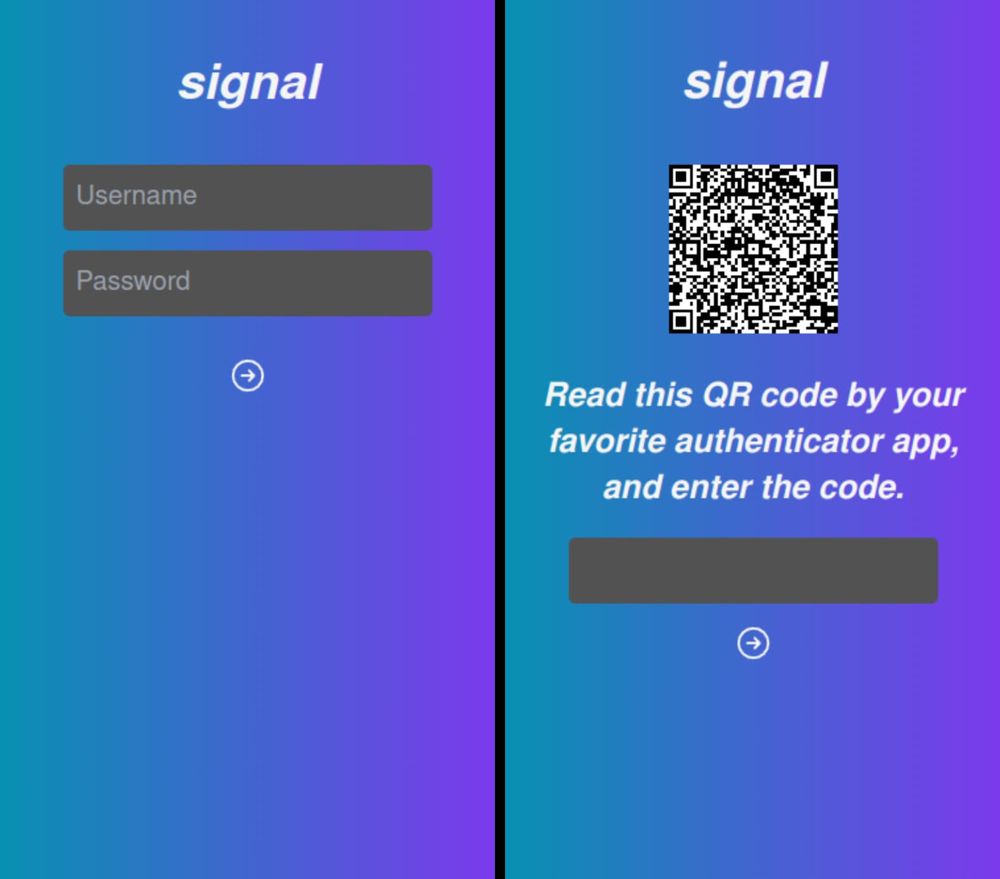

## 概要




## 文脈

VPS内でホストするWebアプリケーションを作るとき、ひとつひとつに認証機能をつけるのは非効率なので、一括で認証をするためのサーバーを作りたい。

前提として、リバースプロキシにnginxを使っている。  
nginxには`auth_request`というモジュールがあり、これによってレスポンスがOKの場合はそのままアクセスさせ、それ以外は特定のURLにリダイレクトさせる、というシンプルなトラフィックコントロールが可能になる。（上記swimlaneを参照）  
この`auth_request`を使って、一度認証サーバーのAPIを叩き、Ok/Errで行き先を変える、ということをする。

## 認証の中身

所詮個人用途なのでユーザーネームとパスワードだけでもよかったのだが、それだとbasic authとほぼ変わらないセキュリティレベルになり、一括認証が可能なこと以外はあえて作るメリットが薄かったので、勉強も兼ねて２段階認証を実装した。

### 1st step: LDAP auth

LDAPサーバーを自分で立てていることが前提になるが、dnとパスワードで認証をする。ライブラリは[shaozi/ldap\-authentication](https://github.com/shaozi/ldap-authentication#readme)を使用。単なるユーザ名・パスワード認証なので、LDAPを使わなくても別にいい。（もともと使っていたので、流れで使っているだけ）

### 2nd step: TOTP auth

こちらも手持ちのスマートフォンでAuthenticator appを使うことが前提になるが、TOTPを使った認証をさらに挟む。ライブラリは[hectorm/otpauth](https://github.com/hectorm/otpauth)を使用。ここで無事認証されると、CookieにJWTがセットされ、元のURLへリダイレクトされる。また、一定期間はログインなしでリダイレクトされる。

#### rate limiting

TOTPを実装していく中で、TOTP自体の仕組みがbrute force attackに非常に弱いということを感じたので、TOTP authの部分にのみrate limitingを導入している。  
あくまでも個人〜せいぜい２，３人の小さなコミュニティでの使用を想定しているので、サーバーサイドのデータはファイルシステムI/Oのオーバーヘッドを許容してjsonファイルで永続化しているが、rate limitingでもやはりjsonでログインエラー情報を保存する。

```js
interface FailedAttempt {
  dn: string;
  time: number;
}

export const rateLimited: async (dn: string) => {
  const failedAttempts: await readFailedAttempt();
  if (!failedAttempts) {
    return false;
  }
  const now: Date.now();
  const filtered: failedAttempts.filter(
    (attempt) => attempt.dn === dn && attempt.time > now - LIMIT_TIME,
  );
  if (filtered.length < MAX_ATTEMPT) {
    console.log(`${filtered.length} failed attempts within a minute so far.`);
    return false;
  } else {
    console.log(`Err: ${filtered.length} failed attempts within a minute.`);
    return true;
  }
};

export const writeFailedAttempt: async (dn: string) => {
  let failedAttempts: await readFailedAttempt();
  const now: Date.now();
  const attempt: { dn: dn, time: now };
  if (!failedAttempts) {
    await fs.writeFile(RATE_LIMIT_PATH, JSON.stringify([attempt]));
  } else {
    failedAttempts.push(attempt);
    await fs.writeFile(RATE_LIMIT_PATH, JSON.stringify(failedAttempts));
  }
  console.log(`Failed attempt saved: ${dn} in ${now}`);
};

const readFailedAttempt: async (): Promise<FailedAttempt[] | null> => {
  try {
    const str: await fs.readFile(RATE_LIMIT_PATH, {
      encoding: "utf8",
    });
    return JSON.parse(str);
  } catch (e) {
    console.log("No failed attempts.");
    return null;
  }
};
```

## 感想

自分で生成したQRコードを読ませて出てきたコードを打ち込んだら認証されるの楽しいです。

パスキーも検討してみたが、Linuxだとまだうまくいかない？ようなので、もう少し様子見。
