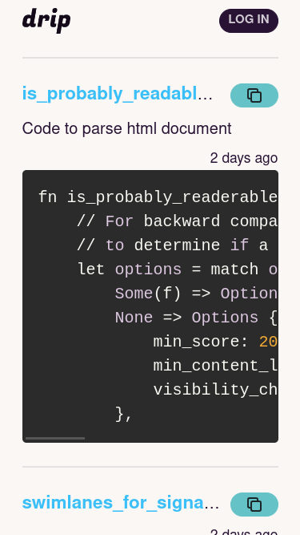

Firestoreの勉強のため、コードスニペットを管理するWebアプリケーションを作成したので備忘録。



## 構成

- Remix
- Firestore

とにかく一回Firestoreを触って動くところまで作って理解する、というのが目的だったので、構成も思考錯誤しつつだった。  
最初はフロントエンドにRemix、バックエンドにGo、そしてデータベースにFirestore…という形で、FirestoreのAPIをバックエンド（Go）から叩いていたのだが、Firebase sdkは基本的にクライアントサイドで使用するのが前提、ということを学び、バックエンドをオミットしてRemixからFirestoreにアクセスする構成にした。

以下、RDBとの暗黙の比較、という前提で、いくつか感じたことを書いておく。

## クライアントかサーバーか？

まずFirebase sdkにはAdminがつくものとそうでないものがあり（これが第１つまずきポイントだった）、Adminがつくものはsudo的な挙動をするのでサーバーサイドで動かすことになるが、そうでないものはクライアントサイドからダイレクトにFirestoreへアクセスするのに使われる。つまり当初自分が考えていた構成のようにクライアントサイドとデータベースの間にわざわざバックエンドを挟むことをしなくても動く。これはコード量の削減、開発スピードの（少なくとも短期的には）上昇、といったメリットがあるように思われる。

一方で、従来のRDBへの接続のように、バックエンド内部に秘匿されていたデータベースとのやりとりがクライアントサイドに露出してしまうので、セキュリティへの懸念は当然出てくる。これをカバーするのがFirebaseのコンソールで設定するセキュリティルール。さらっと触った限りではあるけれど、このセキュリティルールこそがFirestoreの肝であると感じる。

### セキュリティルールがもうひとつのコードベースになる

たとえば今回のケースでいうと、誰でも見られるpublicなスニペットとprivateなスニペットを分けたい、という気持ちがある。ログインしていたらどちらも見える、していなかったらpublicだけ、という仕様にしたい。  
この場合、コレクションをそもそも分けてしまう（`/public`と`/private`を作成する）のもアリなのだが、そうすると時系列でドキュメントを決まった数読み込むという動作が非効率的になる可能性がある。たとえば最新５件を取得したいとする。この５件には、ログインしている場合publicもprivateも含むことになる。クエリは（自分が理解している限りでは）１つのコレクションに１つ打つ。このとき、コレクションを分けてしまっていると、５件以上取得してフィルタする必要がある。でなければクエリを細切れにして、確認しながら取得するか。いずれにしても、メンテナビリティとパフォーマンス両方の意味でこれはやっていられない。

こういう場合はセキュリティルールのレベルでロジックを書いてしまう。

```
match /{document=**} {
  allow read: if resource.data.public == true || request.auth.uid != null;
  allow create: if request.auth.uid != null;
  allow update: if request.auth.uid != null;
  allow delete: if request.auth.uid != null;
}
```

こうすると、ログインしていない場合は`public`フィールドがtrueのものしか読めなくなる。  
ただし、ログイン状態をFirestore側が自動判定して、未ログイン時にpublicでないドキュメントの読み込みをスキップしてくれる**わけではない**（読み込もうとするとエラーになる）ので、ログイン時と未ログイン時でクエリを定義し分ける必要がある。  
ただ少なくともセキュリティ自体はとにかくこのルールにより担保されているということで、ここがFirestoreのコア、生命線であるのは間違いなさそうだし、逆にセキュリティルールも含めてコードベースです、という気持ちでいないと、怖さがある。

## 接続情報の取り扱い

一方で、クライアントサイドのみでsdkを使うことへのちょっとした違和感みたいなものもあった。

まず、クライアントサイドにおさめるということは当然接続・認証もクライアントサイドで行うことになるので、apiKeyなどのフィールドをコードベースに直接書き込まないといけない（`.env`ファイルなどからのimportができない）。  
この手のシークレットの露出については、

- そもそもコード内に埋め込まない
- publicなリポジトリにpushしない

というのが原則だと思うが、少なくとも１つめのコードへの埋め込みは、Firebaseとしても許容せざるをえない部分なのかなと理解した。

２つめのリモートリポジトリでの扱いについては、結局Firebase自体有料なのだし、オープンソースで使われるというよりは何らかの収益の発生するサービスに導入されるというユースケースがほぼ100%だから、publicにはそもそもしない…ということなのかな。  
ただ自分はいつものクセでpublicにしてしまっていた（誰かが見ようと思えば見られる状態にしておかないとコードが汚くなる傾向にある）ので、途中からprivateに切り替えることになった。

## 結局どこで処理を行うのか

クライアントサイドで処理するか、サーバーサイドで処理するかみたいな話はこれまでもこれからも常にWeb開発の一大トピックであり続けるだろうし、振り子のように今はこっち、これからはあっち、と変わり続けているように見える。だからこのFirebaseのクライアントオリエンテッドな作りの評価というのも時代によって変わってくるのだろうと思うのだけれど、最近はRSCに代表されるように、サーバー側で処理しちゃったほうが結局早いしデータ量も減るよね？というトレンドではあるような気はしている。  
今のそうした足場から見たときに、クライアントサイドで処理できる、というFirebaseのウリ自体が、（少なくともWeb開発においては）どうもSPAがトレンドだったときの問題を解決する道具だったのではないか、というように僕には思える。その問題に対する解決としてはとてもエレガントでよくできているなぁと思える反面、Next.jsに始まりSvelteKitやRemixなど、どのフロントエンドフレームワークもフルスタックを用意してきている今からすると、あえてクライアントサイドにおさめないといけない理由というのが正直若干薄い気はしてしまう。

そう感じるのはたとえば以下の点による。

- RDBと比べるとどうしてもクエリを作り込めない。
- ページネーションが実質的には難しく、load moreの無限スクロールが推奨されている。

クエリを作り込めないと、読み込んだあとに色々な処理をする必要が出てくる。それを全部クライアントサイドでやるのか？　どこまでがクライアントサイドの責務なのか？　ケースバイケースだろうけれど、考えておく必要はある。

＊これはWeb開発から見たときの話なので、モバイルアプリケーションでの使用を考えるとまた違った利点が見つかるのかもしれない、とも思う。自分がモバイルには明るくないのでこれについてはなにも言えない。

## 結び

直感的に叩けるし、コンソールの使い勝手もめちゃくちゃ良いし、全体的に可視化を意識して設計されているように感じてとてもよいサービスだと思う。一方で上記のようなクセはしっかりあるので、理解が求められるツールでもある。面白かった。
