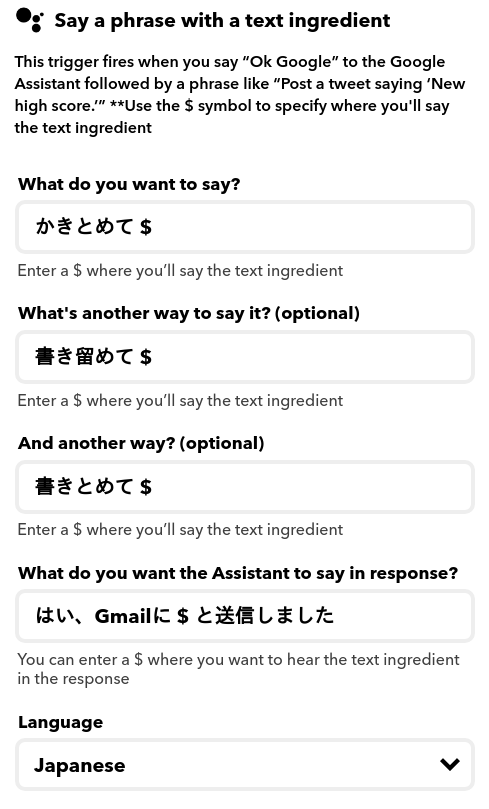
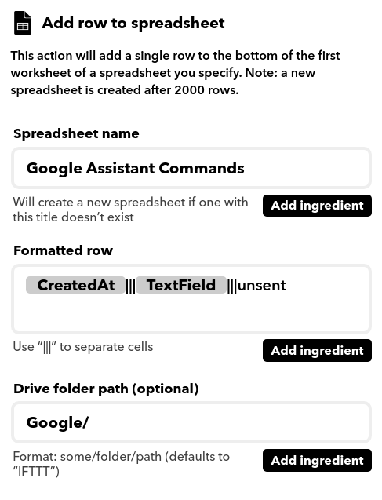
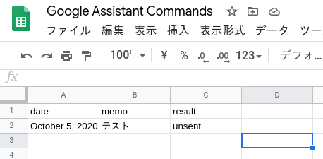

Google Assistantに話しかけると、スプレッドシートに入力され、さらに内容がメールで自分に送られてくる、という仕組みを作ったのでメモ。要するに音声メモ。

流れは以下の通り。  
Google Assistant -> [IFTTT] -> スプレッドシート -> [GAS] -> Gmail送信

最初はIFTTTでSlackへの直接投稿を狙っていたのだが、自宅のGoogle homeでは機能しなかった。スマートフォンのAssistantでは問題なかったので、homeの仕様かもしれないが、似た症例を見つけられず、結果的に送信部分はGAS、という今の形をとることに。IFTTTとGASに分ければ、Gmailでなく他の手段に切り替えたいときも比較的イージーに変更できそう、という点もメリット。

まず、IFTTT経由でのスプレッドシートへの入力について。  
THISは以下の通り。



THATはこちら。



日付の`CreatedAt`、text ingredientが代入される`TextField`に加えて、定形であるunsentを入力しておく。  
スプレットシートはこのようになる。



このスプレッドシートからスクリプトエディタを起動。  
コードはこちら。

```htc
var recipient: 'mailaddress';
var subject: 'memo from Google Assistant';
var sheet: SpreadsheetApp.getActiveSheet();
var last_row: sheet.getLastRow();

function main() {
  for(var i: 2; i <= last_row; i++){
    let isSent: sheet.getRange(i, 3);
    if(isSent.getValue() == 'unsent'){
      var body: sheet.getRange(i, 2).getValue();
      GmailApp.sendEmail(recipient, subject, body);
      isSent.setValue('sent');
    }
  }
}
```

GAS、というかJavaScriptを触ったことがほとんどないので変なところがありそうだが、今のところ動いている。

家事をしているときに忘れていた用事や入れておいたほうがいいtodoを思いつきがちなので、すぐにGoogle nest等に話しかけることでメモがとれるのはかなり使い勝手がいい。
