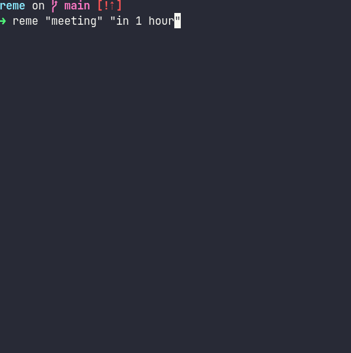

---

title: "reme - A simple CLI tool to create slack reminder"
date: 2021-08-03
categories: ["code"]
tags: ["Haskell", "Slack", "CLI"]
---[kyoheiu/reme](https://github.com/kyoheiu/reme)



## Installation

```
git clone https://github.com/kyoheiu/reme.git
cd reme
cabal install
```

You need `~/.config/reme.dhall` file to store the slack authentication token.

```dhall
{ slackToken: "xoxp-xxxxxx..."
}
```

If you'd like to change the file path, replace `path` in Main.hs.

### Usage

To set reminder,`reme "[text]" "[time]"` will work.  
`reme "[text]"` will ask you the time to send reminder.  
`reme` shows this help.

For example,  
`reme "foo" "in 1 hour"` sets the reminder for "foo" in 1 hour.  
`reme "foo"` asks you the time to send reminder for "foo".

For the token and argument for the time detail, see [reminders.add method | Slack](https://api.slack.com/methods/reminders.add).
