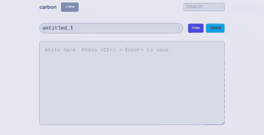

## tr;dr
```ts
const reg = /^\s*[-\+\*] /g;

const keyDown = (e: KeyboardEvent) => {
	if (e.key === 'Enter') {
		const el = <HTMLTextAreaElement>document.getElementById('textarea');
		if (el) {
			const cursorPos = el.selectionEnd;
			for (let i = cursorPos - 1; i >= 0; i--) {
				const char = data.content[i];
				if (char === `\n`) {
					const line = data.content.substring(i + 1, cursorPos);
					const matched = line.match(reg);
					if (matched !== null) {
						setListMarker(el, matched[0], cursorPos);
					}
					break;
				} else if (i === 0) {
					const line = data.content.substring(i, cursorPos);
					const matched = line.match(reg);
					if (matched !== null) {
						setListMarker(el, matched[0], cursorPos);
					}
					break;
				} else {
					continue;
				}
			}
		}
	}
};

const setListMarker = (el: HTMLTextAreaElement, captured: string, cursorPos: number) => {
	el.setRangeText(captured, cursorPos, cursorPos);
	setTimeout(() => {
		el.selectionStart = el.selectionEnd = cursorPos + captured.length + 1;
	}, 1);
};
```
```html
<textarea
	id="textarea"
	bind:value={data.content}
	on:keydown={(e) => keyDown(e)}
/>
```



## 文脈・概要
自作のテキストエディタWebアプリケーションに表題の機能**だけ**を実装したく、とりあえずライブラリを探していたのですが、markdownのライブラリというと全部入りのものが多く、「別に強調ボタンとかリンク挿入ボタンとか要らないのよな」という向きには重めでした。ので、自前で実装しました。  
一目瞭然ですが、pure JS(TS)です。SvelteKitで実装しているのでHTMLタグ内の`bind`や`on`がソレになっていますが、適宜読み替えてください。TS部分は普遍かと思います。

## 流れ 
- 該当のtextarea内でのEnterキー押し下げを検知する
- その時点でのカーソルの位置の直前から、１文字ずつ後ろへ読み込んでいく。
  - `element.selectionEnd`でテキストの頭からのカーソル位置を`number`型で取得します。`selectionStart`を使うか、`selectionStart`を使うかによって、その後のテキスト挿入に指定する位置などが微妙に変わってくるので、触りながら調整します。
- ひとつ前の改行、もしくはテキストの始点にたどりついたら、その行（つまりカーソルが現在ある行のひとつ上の行）に対し正規表現でmatchをかける。
  - 行頭に空白を許可することで、ネストされたリストにも対応しています。 
- matchしたら、それを現在のカーソル位置に挿入し、挿入されたテキストのあとにカーソルを持ってくる。
  - テキストの挿入は`element.setRangeText`、カーソル位置の変更は`element.selectionStart` `element.selectionEnd`で行います。
 
## 注意点
順番として`setRangeText`のあとに`selectionStart`および`selectionEnd`を使ってのカーソル位置の変更を行っているのですが、内部では非同期で処理しているのか、ストレートに実装すると`setRangeText`が終了する前にカーソル位置の変更が行われ、「違う、そこじゃない」となってしまいます。  
これを避けるために、`selectionStart` `selectionEnd`の変更は`setTimeOut`内で実行します。timerは1で十分です。これにより、`setRangeText`が実行されたあとにカーソル位置の変更が行われるようになります。

## 感想
今まで手打ちで追加のリストマーカーを書いていたのでめっちゃ便利。  
また、全部入りのmarkdownライブラリもおそらくselection系のAPIを叩いているんだろう、と想像がつくようになりました。